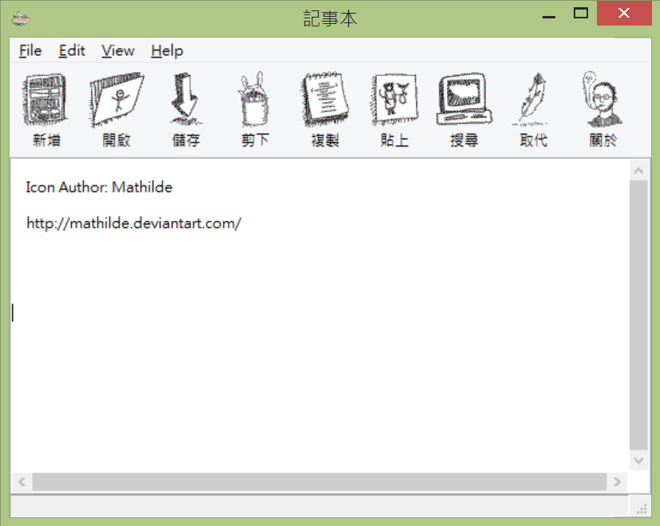

# GNotepad

 - A simple text editor using GTK+

## Running Environment

- Any systems that installed the GTK+ Runtime Environment (eg. For Windows: http://sourceforge.net/projects/gtk-win/)

## Development Environment

- Dev C++ (http://orwelldevcpp.blogspot.tw/)
- Glade/Gtk+ for Windows (http://sourceforge.net/projects/gladewin32/)
- Dev-C++ Development Packages for GTK+ (http://sourceforge.net/projects/devpaks/files/gtk%2B/gtk%2B%202.6.9/)

## Icon Information

- Sketchy icons (https://www.iconfinder.com/iconsets/Sketchy_icons_by_ma)
- Author : Mathilde (http://mathilde.deviantart.com/)

## License

- GNU General Public License (http://www.gnu.org/copyleft/gpl.html)

